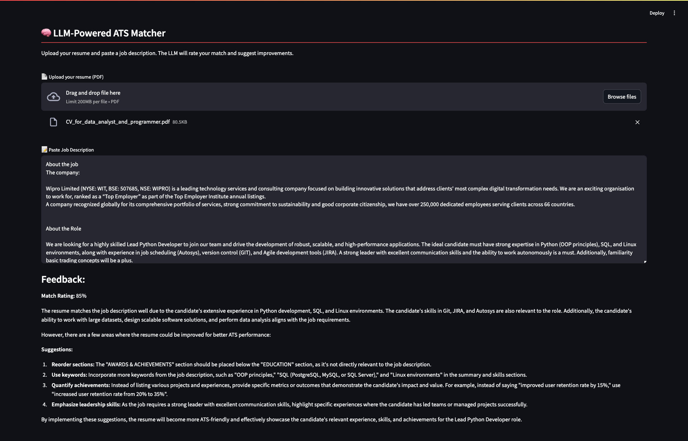

# 🧠 LLM-Powered ATS Resume Matcher

A lightweight, intelligent resume analyzer built with **Streamlit**, **LangChain**, and **Ollama**. This app compares your **PDF resume** with a **job description** using a local LLM (e.g., `llama3`) and provides feedback, ATS optimization suggestions, and rewrites based on prompt-driven reasoning.


<br/>
<div align="center" style="flex-direction: column;">
  
  <div style="font-size: 0.8em; color: gray;">Demo UI</div>
</div>

<br/>


---

## 🚀 What It Does

* ✅ Upload your **PDF resume**
* ✅ Paste a **LinkedIn or other job description**
* ✅ Uses a local LLM (via **Ollama** + **LangChain**) to:

  * Extract common keywords
  * Calculate a basic match score
  * Suggest 3–5 ATS improvements

---

## 📘 Example Output

* **Match Score**: 78.2%
* **Suggestions**:

  * Add keywords like “agile,” “sprint planning,” and “cross-functional teams”
  * Move certifications closer to the top
  * Quantify accomplishments with metrics (e.g., “increased efficiency by 20%”)
* **Rewritten Resume**: A tailored, ATS-friendly version using job-specific phrasing

---

## 🔮 Planned Future Improvements

> The current version is designed to be simple and prompt-based, with minimal dependencies. Future updates will expand its intelligence and utility.

### ✅ Roadmap:

* [ ] **Scrape job descriptions** from LinkedIn or other sources
* [ ] **Skill gap detection** – highlight what's missing in the resume
* [ ] **Token-level keyword highlighting** between resume and job
* [ ] **Job title classification** to adjust tone and structure accordingly

---

## 📦 Requirements

Install dependencies:

```bash
pip install -r requirements.txt
```

Install [Ollama](https://ollama.com/download) and Start the Ollama server and pull a model:

```bash
ollama run llama3
# or
ollama pull mistral
```

---

## 🖥️ Run the App

```bash
streamlit run main.py
```

---

## 🤝 Contributions

Pull requests are welcome! Got an idea? Open an issue and let’s make this smarter together.
